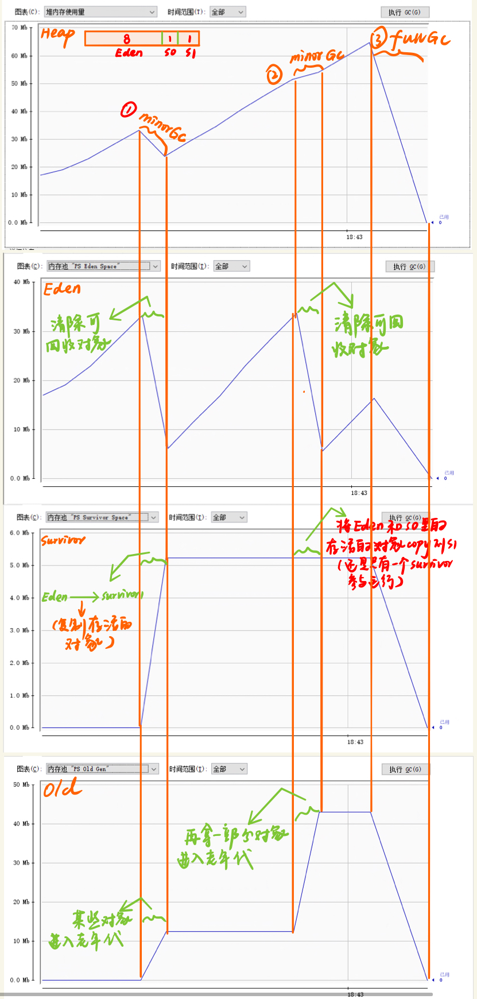

[TOC]

## JDK的命令行工具

### jps(java process status)：查看Hotspot虚拟机进程，显示正在运行的主类的全名

- jps -l ：查看进程以及正在运行的主类

```shell
E:\jdk1.8\bin>jps -l
25632 cr.jdkcmd.HelloWorld #正在运行的主类
22996 cr.jdkcmd.HelloWorld2#正在运行的主类
27092 sun.tools.jconsole.JConsole
14012
25420 org.jetbrains.jps.cmdline.Launcher
31484 sun.tools.jps.Jps
32492
```

- jps -m :显示主类所接收的参数

```powershell
E:\jdk1.8\bin>jps -m
21488 HelloWorld aaa # 参数为aaa
3408 Jps -m
27092 JConsole
10396 HelloWorld2 bbb  # 参数为aaa
14012
32492
```

- jps -v :显示虚拟机参数

```shell
E:\jdk1.8\bin>jps -v
22784 Jps -Dapplication.home=E:\jdk1.8 -Xms8m
27092 JConsole -Dapplication.home=E:\jdk1.8 -Xms8m -Djconsole.showOutputViewer
15304 HelloWorld2 -javaagent:E:\intellijidea2017\IntelliJ IDEA 2017.2.4\lib\idea_rt.jar=60477:E:\intellijidea2017\IntelliJ IDEA 2017.2.4\bin -Dfile.encoding=UTF-8
```

- 显示所有信息

```shell
E:\jdk1.8\bin>jps -mlv
30768 sun.tools.jps.Jps -mlv -Dapplication.home=E:\jdk1.8 -Xms8m
27092 sun.tools.jconsole.JConsole -Dapplication.home=E:\jdk1.8 -Xms8m -Djconsole.showOutputViewer
15304 cr.jdkcmd.HelloWorld2 bbb -javaagent:E:\intellijidea2017\IntelliJ IDEA 2017.2.4\lib\idea_rt.jar=60477:E:\intellijidea2017\IntelliJ IDEA 2017.2.4\bin -Dfile.encoding=UTF-8
```

### jstat：查看虚拟机类装载，内存，垃圾收集，JIT编译等信息

 命令行格式：**jstat** [ *generalOption* | *outputOptions vmid* [ *interval*[s|ms] [ *count* ] ]

```powershell
E:\jdk1.8\bin>jps
27092 JConsole
31508 Launcher
21016 Jps
3864 HelloWorld2
14012
32492

E:\jdk1.8\bin>jstat -gcutil 3864
  S0     S1     E      O      M     CCS    YGC     YGCT    FGC    FGCT     GCT
  0.00   0.00  13.12   0.00  17.20  19.76      0    0.000     0    0.000    0.000
```

```shell
E:\jdk1.8\bin>jstat -gcutil  12972 1000 20
  S0     S1     E      O      M     CCS    YGC     YGCT    FGC    FGCT     GCT
  0.00   0.00  53.12   0.00  17.20  19.76      0    0.000     0    0.000    0.000
  0.00   0.00  56.20   0.00  17.20  19.76      0    0.000     0    0.000    0.000
  0.00   0.00  59.28   0.00  17.20  19.76      0    0.000     0    0.000    0.000
  0.00   0.00  62.35   0.00  17.20  19.76      0    0.000     0    0.000    0.000
  0.00   0.00  65.43   0.00  17.20  19.76      0    0.000     0    0.000    0.000
  0.00   0.00  68.51   0.00  17.20  19.76      0    0.000     0    0.000    0.000
  0.00   0.00  71.59   0.00  17.20  19.76      0    0.000     0    0.000    0.000
  0.00   0.00  74.66   0.00  17.20  19.76      0    0.000     0    0.000    0.000
  0.00   0.00  77.74   0.00  17.20  19.76      0    0.000     0    0.000    0.000
  0.00   0.00  80.82   0.00  17.20  19.76      0    0.000     0    0.000    0.000
  0.00   0.00  83.89   0.00  17.20  19.76      0    0.000     0    0.000    0.000
  0.00   0.00  86.97   0.00  17.20  19.76      0    0.000     0    0.000    0.000
  0.00   0.00  90.05   0.00  17.20  19.76      0    0.000     0    0.000    0.000
  0.00   0.00  93.12   0.00  17.20  19.76      0    0.000     0    0.000    0.000
  0.00   0.00  96.20   0.00  17.20  19.76      0    0.000     0    0.000    0.000
  0.00   0.00  99.28   0.00  17.20  19.76      0    0.000     0    0.000    0.000
  0.00  97.03   3.08  29.25  71.85  75.57      1    0.009     0    0.000    0.009
  0.00  97.03   8.09  29.25  71.85  75.57      1    0.009     0    0.000    0.009
  0.00  97.03  11.17  29.25  71.85  75.57      1    0.009     0    0.000    0.009
  0.00  97.03  14.25  29.25  71.85  75.57      1    0.009     0    0.000    0.009
```

```shell
-gcutil option
Summary of garbage collection statistics.

S0: Survivor space 0 utilization as a percentage of the space's current capacity.

S1: Survivor space 1 utilization as a percentage of the space's current capacity.

E: Eden space utilization as a percentage of the space's current capacity.

O: Old space utilization as a percentage of the space's current capacity.

M: Metaspace utilization as a percentage of the space's current capacity.

CCS: Compressed class space utilization as a percentage.

YGC: Number of young generation GC events.

YGCT: Young generation garbage collection time.

FGC: Number of full GC events.

FGCT: Full garbage collection time.

GCT: Total garbage collection time.
```

M: Metaspace utilization as a percentage of the space's current capacity.

M代表元空间，元空间和永久代类似，但是元空间与永久代的最大区别在于：元空间不再虚拟机中，而是使用本地内存，因此，默认情况下，元空间的大小仅受本地内存限制

### jinfo：实时查看和调整虚拟机的配置信息等参数

**jinfo** [ *option* ] *pid*

**jinfo** [ *option* ] *executable core*

**jinfo** [ *option* ] *[ servier-id ] remote-hostname-or-IP*

```shell
E:\jdk1.8\bin>jps -v
10816 HelloWorld -javaagent:E:\intellijidea2017\IntelliJ IDEA 2017.2.4\lib\idea_rt.jar=56116:E:\intellijidea2017\IntelliJ IDEA 2017.2.4\bin -Dfile.encoding=UTF-8
11120 Jps -Dapplication.home=E:\jdk1.8 -Xms8m
14012  -Xms1024m -Xmx2048m -XX:ReservedCodeCacheSize=240m 
-XX:+UseConcMarkSweepGC -XX:SoftRefLRUPolicyMSPerMB=50 -ea -Dsun.io.useCanonCaches=false -Djava.net.preferIPv4Stack=true -XX:+HeapDumpOnOutOfMemoryError -XX:-OmitStackTraceInFastThrow -Dfile.encoding=UTF-8 -Djb.vmOptionsFile=E:\intellijidea2017\IntelliJ IDEA 2017.2.4\bin\idea64.exe.vmoptions -Xbootclasspath/a:E:\intellijidea2017\IntelliJ IDEA 2017.2.4\lib\boot.jar -Didea.jre.check=true -Didea.paths.selector=IntelliJIdea2017.2 -XX:ErrorFile=C:\Users\xiaoqiu\java_error_in_idea_%p.log -XX:HeapDumpPath=C:\Users\xiaoqiu\java_error_in_idea.hprof
32492  -Dfile.encoding=UTF-8 -Xms128m -Xmx1024m -XX:MaxPermSize=256m

E:\jdk1.8\bin>jinfo -flag UseConcMarkSweepGC 14012
-XX:+UseConcMarkSweepGC #+号表示采用了ConcMarkSweepGC垃圾收集器 

E:\jdk1.8\bin>jinfo -flag UseG1GC 14012
-XX:-UseG1GC #-号表示没有采用G1GC垃圾收集器
```

```shell
-flag name #查看参数
Prints the name and value of the specified command-line flag.

-flag [+|-]name #设置参数
enables or disables the specified Boolean command-line flag.

-flag name=value #设置参数
Sets the specified command-line flag to the specified value.

-flags
Prints command-line flags passed to the JVM.
```

### jmap：生成堆转储快照，查询finalize执行队列，Java堆和永久代的详细信息，空间使用率，垃圾收集器

```shell
jmap [ options ] pid

jmap [ options ] executable core

jmap [ options ] [ pid ] server-id@ ] remote-hostname-or-IP
```

```shell
E:\jdk1.8\bin>jmap -dump:format=b,file=d:\a.bin 6236
Dumping heap to D:\a.bin ...
Heap dump file created
```


```shell
-dump:[live,] format=b, file=filename
Dumps the Java heap in hprof binary format to filename. The live suboption is optional, but when specified, only the active objects in the heap are dumped. To browse the heap dump, you can use the jhat(1) command to read the generated file.

-finalizerinfo
Prints information about objects that are awaiting finalization.

-heap
Prints a heap summary of the garbage collection used, the head configuration, and generation-wise heap usage. In addition, the number and size of interned Strings are printed.

-histo[:live]
Prints a histogram of the heap. For each Java class, the number of objects, memory size in bytes, and the fully qualified class names are printed. The JVM internal class names are printed with an asterisk (*) prefix. If the live suboption is specified, then only active objects are counted.

-clstats
Prints class loader wise statistics of Java heap. For each class loader, its name, how active it is, address, parent class loader, and the number and size of classes it has loaded are printed.
```

### Jhat:JVM heap analysis Tool堆快照分析工具

```shell
E:\jdk1.8\bin>jhat d:\a.bin
Reading from d:\a.bin...
Dump file created Fri Jul 19 18:12:29 CST 2019
Snapshot read, resolving...
Resolving 9761 objects...
Chasing references, expect 1 dots.
Eliminating duplicate references.
Snapshot resolved.
Started HTTP server on port 7000#内置的HTTP服务器
Server is ready.
```

进入web页面查看分析结果http://localhost:7000/


### jstack : 查看线程堆栈信息

```shell
E:\jdk1.8\bin>jps
14012
25212 Jps
2572 t6666
30412 Launcher
32492

E:\jdk1.8\bin>jstack -l 2572
2019-07-19 10:12:23
Full thread dump Java HotSpot(TM) 64-Bit Server VM (25.131-b11 mixed mode):

"Service Thread" #13 daemon prio=9 os_prio=0 tid=0x000000001a5b5000 nid=0x798 runnable [0x0000000000000000]
   java.lang.Thread.State: RUNNABLE

   Locked ownable synchronizers:
        - None

"C1 CompilerThread3" #12 daemon prio=9 os_prio=2 tid=0x000000001a51a800 nid=0x3418 waiting on condition [0x0000000000000000]
   java.lang.Thread.State: RUNNABLE

   Locked ownable synchronizers:
        - None

```

### jconsole:java监视与管理控制台可视化工具

**内存监控**：相当于可视化的jstat命令

```java
package cr.jdkcmd;

import java.util.ArrayList;

public class HelloWorld {
    static class  OOMObject{
        public byte[] placeHolder = new byte[64 * 1024];
    }

    public static void main(String[] args){
        try {
            Thread.sleep(10000);
        } catch (InterruptedException e) {
            e.printStackTrace();
        }

        fillHeap(1000);

    }
    public static void fillHeap(int num){
        ArrayList<OOMObject> list = new ArrayList<>();
        for(int i = 0; i < num; i++){

            try {
                Thread.sleep(50);
                list.add(new OOMObject());
            } catch (InterruptedException e) {
                e.printStackTrace();
            }
        }
        System.gc();

    }

}

```

对上面的程序运行进行一个监控



**线程监控**：相当于可视化的jstack命令

线程监控可以用于分析线程长时间等待的原因：

- 等待外部资源：数据库连接、网络资源、设备资源
- 等待获取锁
- 死循环

```java
package cr.jdkcmd;

import java.util.Scanner;

public class Jstack {
    public static void main(String[] args){

        Jstack jstack = new Jstack();
        Scanner scanner = new Scanner(System.in);
        System.out.println("Please input a number:");
        scanner.next();
        jstack.waitThread();
        System.out.println("Please input a number:");
        scanner.next();
        jstack.busyThread();

    }

    /**
     * 等待状态
     */
    public void  waitThread(){

        Object o = new Object();
        Runnable runnable = new Runnable() {
            @Override
            public void run() {
                synchronized (o){
                    try {
                        o.wait();
                    } catch (InterruptedException e) {
                        e.printStackTrace();
                    }
                }
            }
        };
        Thread thread = new Thread(runnable,"wait_thread");
        thread.start();

    }

    /**
     * 死循环
     */
    public void busyThread(){
       Runnable runnable =  new Runnable(){
            @Override
            public void run() {
                while (true);
            }
        };

        Thread busy_thread = new Thread(runnable, "busy_Thread");
        busy_thread.start();
    }


}

```

监控结果


输入一个数之后进入waitthread


再输入一个数之后进入busythread


**死锁监测**

```java
package cr.jdkcmd;

public class DeadLock implements Runnable{
    int a,b;

    public DeadLock(int a, int b) {
        this.a = a;
        this.b = b;
    }

    @Override
    public void run() {
        //获取到a的锁,这里需要锁一个对象，所以将int类型转为integer对象类型
        synchronized (Integer.valueOf(a)){
            //获取到b的锁
            synchronized (Integer.valueOf(b)){
                int res = a + b;
                System.out.println(res);
            }
        }
    }

    public static void main(String[] args){

        //运行多次，让产生死锁的几率更大
        for(int i = 0; i < 1000; i++){
            Thread thread = new Thread(new DeadLock(1, 2));
            thread.start();
            Thread thread1 = new Thread(new DeadLock(2, 1));
            thread1.start();
        }

    }

}

```


### visulVM:多合一故障处理工具

这是一款基于插件的可视化工具，同样也在jdk的bin目录下jvisualvm.exe


